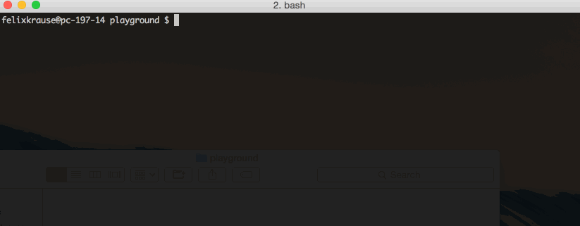

<h3 align="center">
  <a href="https://github.com/fastlane/fastlane">
    
    <br />
    fastlane
  </a>
</h3>
<p align="center">
  <a href="https://github.com/fastlane/deliver">deliver</a> &bull; 
  <a href="https://github.com/fastlane/snapshot">snapshot</a> &bull; 
  <a href="https://github.com/fastlane/frameit">frameit</a> &bull; 
  <a href="https://github.com/fastlane/PEM">PEM</a> &bull; 
  <a href="https://github.com/fastlane/sigh">sigh</a> &bull; 
  <a href="https://github.com/fastlane/produce">produce</a> &bull;
  <a href="https://github.com/fastlane/cert">cert</a> &bull;
  <b>codes</b> &bull;
  <a href="https://github.com/fastlane/spaceship">spaceship</a> &bull;
  <a href="https://github.com/fastlane/pilot">pilot</a> &bull;
  <a href="https://github.com/fastlane/boarding">boarding</a> &bull;
  <a href="https://github.com/fastlane/gym">gym</a>
</p>
-------

<p align="center">
  
</p>

codes (Deprecated)
============

[](https://twitter.com/KrauseFx)
[](https://github.com/fastlane/cert/blob/master/LICENSE)
[](http://rubygems.org/gems/codes)

###### Create promo codes for iOS Apps using the command line
or
###### Automatically lose money by giving away your app for free...

## This tool is no longer maintained and does not work.


##### This tool was sponsored by [Max Bäumle](http://maxbaeumle.com) and [Textastic Code Editor](http://www.textasticapp.com)

Get in contact with the developers of `codes` on Twitter: [@KrauseFx](https://twitter.com/KrauseFx), [@acrooow](https://twitter.com/acrooow)

-------
<p align="center">
    <a href="#installation">Installation</a> &bull; 
    <a href="#why">Why?</a> &bull; 
    <a href="#usage">Usage</a> &bull; 
    <a href="#tips">Tips</a> &bull; 
    <a href="#considerations">Considerations</a> &bull; 
    <a href="#need-help">Need help?</a>
</p>

-------

<h5 align="center"><code>codes</code> is part of <a href="https://fastlane.tools">fastlane</a>: connect all deployment tools into one streamlined workflow.</h5>


# Installation
    sudo gem install codes

Make sure, you have the latest version of the Xcode command line tools installed:

    xcode-select --install

# Why?

`codes` can help you automate sending promo codes to journalists and create promo codes for tons of apps with the press of a button.

# Usage

    codes [num] [-a app_identifier] [-u user_name] [-i app_id] [-o output_file] [-c country] [-X] [-f format]

All parameters are optional.

`codes` will print out the promo codes and store them in a file called `codes_[your app identifier].txt` in the current directory by default.

Example:

    codes 3 -a com.example.myApp

Will generate 3 promo codes for the the App with the Bundle Identifier `com.example.myApp`. 

If you don't pass any paramaters, `codes` will generate a single promo code and print it on the command line.

## Display extra information

Use the ```--format FORMAT``` argument to control the displayed information. The ```--verbose``` argument displays all information and maps to

    --format '%c,%d,%p,%i,%b,%n,%u'

E.g.

    codes --verbose

will display

    NRTFXP3XXXXX,20150520110716,ios,522069155,com.wewanttoknow.DragonBoxPlus,'DragonBox Algebra 5+',https://buy.itunes.apple.com/WebObjects/MZFinance.woa/wa/redeemLandingPage?code=NRTFXP3XXXXX

For example, if you want a custom URL, you could use something like

    codes --format '%c: http://yoursite.com/redeem/%c'

## Generate URLs

    codes 5 --urls

If specified, includes a full URL for each code that can be used to redeem that code.



##### [Like this tool? Be the first to know about updates and new fastlane tools](https://tinyletter.com/krausefx)

## Environment Variables
In case you prefer environment variables:

- ```CODES_USERNAME``` (Your iTunes Connect username)
- ```CODES_APP_IDENTIFIER``` (Your App's Bundle ID)
- ```CODES_APP_ID```(Your App's internal iTunes Connect App ID)

# Tips

## [`fastlane`](https://fastlane.tools) Toolchain

- [`fastlane`](https://fastlane.tools): Connect all deployment tools into one streamlined workflow
- [`deliver`](https://github.com/fastlane/deliver): Upload screenshots, metadata and your app to the App Store
- [`snapshot`](https://github.com/fastlane/snapshot): Automate taking localized screenshots of your iOS app on every device
- [`frameit`](https://github.com/fastlane/frameit): Quickly put your screenshots into the right device frames
- [`PEM`](https://github.com/fastlane/PEM): Automatically generate and renew your push notification profiles
- [`sigh`](https://github.com/fastlane/sigh): Because you would rather spend your time building stuff than fighting provisioning
- [`produce`](https://github.com/fastlane/produce): Create new iOS apps on iTunes Connect and Dev Portal using the command line
- [`cert`](https://github.com/fastlane/cert): Create new iOS signing certificates
- [`spaceship`](https://github.com/fastlane/spaceship): Ruby library to access the Apple Dev Center and iTunes Connect
- [`pilot`](https://github.com/fastlane/pilot): The best way to manage your TestFlight testers and builds from your terminal
- [`boarding`](https://github.com/fastlane/boarding): The easiest way to invite your TestFlight beta testers
- [`gym`](https://github.com/fastlane/gym): Building your iOS apps has never been easier

##### [Like this tool? Be the first to know about updates and new fastlane tools](https://tinyletter.com/krausefx)

# Considerations
As part of the process of downloading promo codes from iTunes Connect, the user would normally have to accept a contract every single time. Since there is no way to check with iTunes if this contract was accepted manually before, `codes` agrees to this contract automatically. Before using `codes` for the first time, we advise you to go to iTunes Connect and go through the process of creating promo codes manually at least once and to read the contract when it comes up.

# Need help?
Please submit an issue on GitHub and provide information about your setup

# License
This project is licensed under the terms of the MIT license. See the LICENSE file.

> This project and all fastlane tools are in no way affiliated with Apple Inc. This project is open source under the MIT license, which means you have full access to the source code and can modify it to fit your own needs. All fastlane tools run on your own computer or server, so your credentials or other sensitive information will never leave your own computer. You are responsible for how you use fastlane tools.
